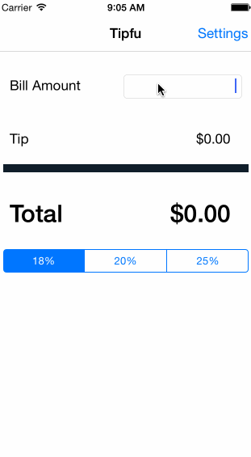

# TipCalculator

This is a Tip Calculator application for iOS submitted as the pre-assignment requirement for Codepath.

Time spent: 3 hours

Completed:

* [x] Required: User can enter a bill amount, choose a tip percentage, and see the tip and total values.
* [x] Required: Settings page to change the default tip percentage.
* [x] Optional: Using locale-specific currency and currency thousands separators.

GIF created with [LiceCap](http://www.cockos.com/licecap/).
